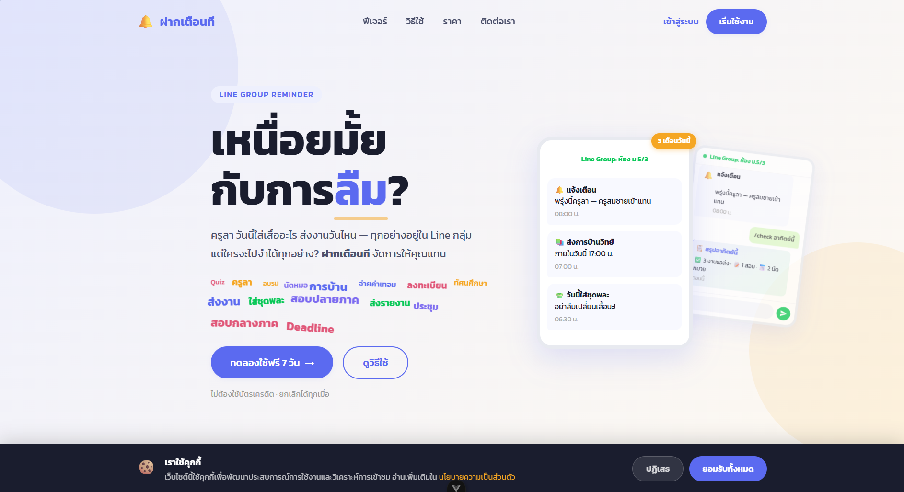

# ฝากเตือนที (Fak Tuan)

> Automated reminder broadcasting for Line group chats — so nothing gets lost in the feed again.



---

## What It Does

**ฝากเตือนที** acts as a middleman between your Google Calendar and your Line group chat. Once connected, it automatically broadcasts scheduled reminders into the group — no manual forwarding, no forgotten deadlines.

Key capabilities:

- **Scheduled reminders** — send ahead by minutes, hours, or days
- **Line group delivery** — messages go directly into the group via Line Messaging API
- **Google Calendar sync** — pull events from any calendar you own
- **Multi-group support** — manage multiple Line groups from one account
- **100% automatic** — fire-and-forget once configured

---

## Tech Stack

| Layer | Technology |
|---|---|
| Frontend | Vue 3 + TypeScript + Vite |
| Animations | GSAP 3 + ScrollTrigger |
| Routing | Vue Router 4 |
| Styling | Scoped CSS + CSS Variables (Kanit font) |
| Tunnel (dev) | Cloudflare Tunnel → `fak-tuan.pwigroups.com` |

---

## Project Structure

```
app/
├── src/
│   ├── views/
│   │   ├── LandingView.vue       # Marketing landing page
│   │   ├── AuthView.vue          # Login / Signup / OTP (4 panels)
│   │   ├── ContactView.vue       # Contact form
│   │   └── PrivacyView.vue       # Privacy policy (PDPA)
│   ├── components/
│   │   ├── landing/
│   │   │   ├── NavBar.vue
│   │   │   ├── HeroSection.vue
│   │   │   ├── AnimatedChatPhone.vue
│   │   │   ├── StatsSection.vue
│   │   │   ├── PainSection.vue
│   │   │   ├── FeaturesSection.vue
│   │   │   ├── HowItWorksSection.vue
│   │   │   ├── PricingSection.vue
│   │   │   ├── CtaSection.vue
│   │   │   └── FooterSection.vue
│   │   └── CookieBanner.vue
│   ├── composables/
│   │   └── useReveal.ts          # GSAP ScrollTrigger helpers
│   ├── router/index.ts
│   └── assets/main.css
├── public/
│   └── img/
│       ├── line-svgrepo-com.svg
│       └── google-calendar-svgrepo-com.svg
docs/
└── img/
    └── home.png
```

---

## Getting Started

### Install dependencies

```sh
npm install
```

### Run development server

```sh
npm run dev
```

### Expose locally via Cloudflare Tunnel

```sh
# Terminal 1 — dev server
npm run dev

# Terminal 2 — tunnel
cloudflared tunnel --config C:\Users\tob\.cloudflared\fak-tuan.yml run
```

Live at: **https://fak-tuan.pwigroups.com**

### Type-check, compile and minify for production

```sh
npm run build
```

### Run unit tests

```sh
npm run test:unit
```

---

## Pages & Routes

| Route | Page |
|---|---|
| `/` | Landing page |
| `/auth` | Authentication (login, signup, forgot password, OTP) |
| `/contact` | Contact form |
| `/privacy` | Privacy policy |

---

## Recommended IDE Setup

[VS Code](https://code.visualstudio.com/) + [Vue (Official)](https://marketplace.visualstudio.com/items?itemName=Vue.volar)

Disable Vetur if previously installed — it conflicts with Volar.

---

## Configuration

See [Vite Configuration Reference](https://vite.dev/config/) for build options.

The `server.allowedHosts` in `vite.config.ts` is set to `fak-tuan.pwigroups.com` for tunnel access during development.
